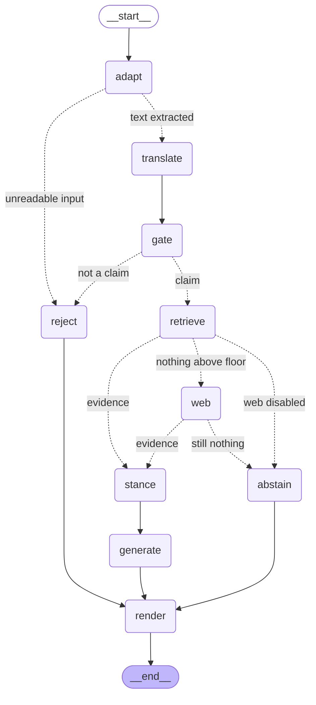

# VerifAI

A fact-verification RAG system that **knows when to say nothing**.

Give it a claim; it retrieves evidence from a curated news corpus, weighs each
source's credibility, and returns a cited verdict — or declines, when the
evidence isn't there.

```bash
python -m serve.cli "India's software exports reached 222 billion dollars in 2024-25"
#  → TRUE, 92% confidence, 3 sources cited, 1 LLM call

python -m serve.cli "the moon is square in shape"
#  → ABSTAINED. Zero LLM calls. Nothing cleared the relevance floor.
```

Claims arrive as **text, a voice note, a screenshot, or a document** — and the
report comes back in the language the claim was made in.

```bash
python -m serve.cli claim.mp3                    # Whisper → verify → spoken reply
python -m serve.cli screenshot.png               # OCR → is this even a claim? → verify
python -m serve.cli --document report.docx "…"   # check a claim against a file
uvicorn serve.api:app                            # web UI, paste screenshots with Ctrl+V
```

> **Demo recording goes here.** Record with `python -m demo.run_demo` (~80s) and
> embed the GIF at `demo/screenshots/demo.gif`.

---

## What makes it different

Most RAG systems cannot say "I don't know", because retrieval always returns
*something*. Cosine similarity has no concept of *nothing here matches* — ask
for the top 5 documents and you get 5 documents, however irrelevant.

Feed a naive pipeline **"the moon is square in shape"** and it will dutifully
retrieve the five least-irrelevant articles it owns and write a confident
analysis. The previous version of this system answered that exact claim with a
700-word report about a celebrity's bridal henna and a foldable phone review.

VerifAI has three exits, and two of them cost nothing:

| Exit | When | Cost |
|---|---|---|
| **Verified** | evidence cleared the relevance floor | 1 LLM call |
| **Abstained** | nothing relevant was found | **0 LLM calls** |
| **Rejected** | the input was not a checkable claim | **0 LLM calls** |

On 20 hand-written claims the corpus provably cannot answer, it abstained on
**20/20**. Across 200 FEVER claims it issued **zero** confidently-wrong verdicts.

---

## Results

Full numbers and methodology: [`eval_harness/results/RESULTS.md`](eval_harness/results/RESULTS.md).
Reproduce with `python -m eval_harness.run_eval --all`.

### Retrieval: before and after the chunking fix

`all-MiniLM-L6-v2` truncates at 256 tokens (~1,000 characters). The original
index embedded whole articles — median length 2,996 characters — so roughly two
thirds of the median document was never in a vector, and **nothing raised an
error**.

Measured over 200 known-item queries drawn from 100 corpus articles. Each
article contributes a query from its **head** (inside the embedder's window)
and one from its **tail** (beyond it). The head slice is the control.

| Tail queries — the truncated region | recall@1 | recall@5 | MRR |
|---|---:|---:|---:|
| Old index (whole articles embedded) | 0.47 | 0.76 | 0.598 |
| New index (chunked 700/100) — *only chunking changed* | **0.88** | **0.95** | 0.904 |
| New index + BM25 fusion + cross-encoder | **0.98** | **0.99** | 0.982 |

| Head queries — control | recall@1 | recall@5 | MRR |
|---|---:|---:|---:|
| Old index | 0.95 | 0.98 | 0.965 |
| New index | 1.00 | 1.00 | 1.000 |

The two indexes are statistically tied on the head slice and 41 points apart on
recall@1 for the tail. That gap is the truncation bug, isolated — same corpus,
same embedding model, same queries.

**Truncation did not make tail content unfindable.** News articles are
topically coherent, so the head vector still retrieves the article by subject.
What it destroyed was *ranking precision*: the correct article was ranked first
only 47% of the time.

> Two decimal places are meaningful; the third is not. Chroma's HNSW is an
> approximate index and the eval moved ±0.01 between runs.

### End-to-end behaviour

| | |
|---|---:|
| Abstention on 20 unanswerable claims | **20 / 20** |
| — caught by the relevance floor (no LLM call) | 16 |
| — caught by the LLM after reading evidence | 4 |
| FEVER: claims seen | 200 |
| FEVER: abstention rate | 0.975 |
| **FEVER: confidently-wrong verdicts (≥70%)** | **0** |

FEVER's gold evidence is Wikipedia, which this corpus does not contain, so a
high abstention rate there is *correct behaviour*, not a failure. Of the 5
claims it did commit to, all 5 were right — but n=5 carries no statistical
weight and shouldn't be read as an accuracy figure. The meaningful numbers on
that set are the abstention rate and the zero false-confidence count, both
computed over all 200.

### Why two mechanisms, not one threshold

The relevance floor was calibrated by sweeping 13 values, not guessed. It
separates *absent from the corpus* from *present in the corpus* cleanly —
every absurd or out-of-corpus claim scored **≤ 0.006**. But it cannot separate
*supports this claim* from *is merely about the same subject*: every claim that
survived every floor was one asserting a false fact about a subject the corpus
covers well ("OpenAI was founded in 2010", scoring 0.86).

Raising the floor from 0.02 to 0.60 improves adversarial abstention only
0.70 → 0.85 while costing real recall. So the floor handles the cheap cases and
the LLM's `directly_relevant` judgement handles the rest. That is why the output
schema has that field.

---

## Multimodal input

| Input | How | Comes back as |
|---|---|---|
| Text | — | report in the detected language |
| Voice | Groq `whisper-large-v3` | report **+ spoken mp3** in that language |
| Image | Tesseract OCR | extracted sentence, then a verdict |
| PDF / DOCX | PyPDF2 / python-docx | verdict, or a claim extracted from the file |

The **image** case is the one worth explaining. The workflow it serves: you see
a claim in an Instagram or WhatsApp post, screenshot it, paste it in with
`Ctrl+V`. OCR lifts the sentence out, and the claim gate then answers the
question you actually have — *is this even a checkable factual claim, or is it
opinion, a joke, or engagement bait?* Only then does verification run.

```
insta_post.png     → OCR: "India's software exports reached 222 billion
                       dollars in 2024-25"        → TRUE @ 80%, 2 sources
insta_opinion.png  → OCR: "what time does the match start tonight?"
                                                 → rejected, 0 LLM calls, 1.0s
```

**A Hindi claim is not translated back.** It is translated *into* English to
search an English index, and the report is then **generated in Hindi** by the
model. One generation, one verdict — a back-translated report drifts from the
one the API returned, and verdict labels can shift in the round trip.

### Attaching a document cannot make its claim true

Upload a file asserting something and ask whether that thing is true, and a
naive system confirms it using your own attachment as evidence. That is the most
obvious way to fool a fact-checker, so an upload:

- is capped at **0.6 credibility**, applied *after* normal weighting so it is a
  ceiling rather than an input — an upload can't inherit authority from a
  high-scoring domain,
- is labelled `⚠ UNVERIFIED USER SUBMISSION` in the evidence block the model
  sees, with an instruction to treat it as the claim restated rather than
  evidence for it,
- still goes through the same relevance floor, so an irrelevant upload is
  dropped rather than padding the evidence list.

A DOCX asserting *"India's software exports reached 40 billion dollars in
2024-25"* returns **FALSE at 85%** — the corpus refutes the attachment.

---

## Architecture

Two tiers that share **files, not imports**.

```
TIER 1 · ingest/                    TIER 2 · serve/
run on demand, offline              runs while you demo
write-only                          read-only

clean → chunk → embed → index       adapt → gate → retrieve → generate
            │                                    ↑
            ▼                                    │
    ┌───────────────────────┐   reads            │
    │  index/v1/            │────────────────────┘
    │    chroma/            │
    │    parents/           │   THE CONTRACT
    │    bm25.pkl           │
    │    manifest.json      │
    └───────────────────────┘
```

The index is a **versioned artifact**. Tier 1 builds into `index/v{n}/`,
validates it, and only then points `index/CURRENT` at it. The corpus can be
rebuilt or the embedding model swapped without touching serving code, and the
API restarts without re-crawling anything. Rolling back is a one-line file write.

`manifest.json` is a safety interlock: it records the embedding model and
dimension, and **Tier 2 refuses to boot on a mismatch**. Indexing with one model
and querying with another produces plausible garbage and raises nothing — this
is fifteen lines that catch the single most common silent RAG failure.

### The serving graph

Nodes and edges are generated from the running code — run
`python -m serve.cli --graph` to print the current diagram, so this cannot
silently drift from what the system does. Only the edge *labels* below are
added by hand, for readability.



Retrieval runs at **chunk level** — dense (Chroma) and sparse (BM25) fused by
reciprocal rank, then reranked by a cross-encoder — and expands to **whole
articles** only after compression. Chunks are what embed well; articles are what
the LLM reasons well over. Reranking before expansion matters: the cross-encoder
also truncates at 512 tokens, so reranking full articles would reintroduce the
exact bug the chunking fixed.

Want the whole path in detail? [**`docs/execution-trace.html`**](docs/execution-trace.html)
follows one claim from the browser keystroke to the rendered report, naming
every file, function and line number on the way, with the real numbers each
stage produced.

---

## Quickstart

**Prerequisites:** Python 3.11+, ~2 GB disk, no GPU.

```bash
git clone https://github.com/nitish2k27/multi-hop-claim--verification1.git
cd multi-hop-claim--verification1/fact-verification-system2

python -m venv venv
venv\Scripts\activate            # Windows
# source venv/bin/activate       # macOS / Linux

pip install -e .

copy .env.example .env           # Windows  (cp on macOS/Linux)
```

Then open `.env` and set **`GROQ_API_KEY`** — free at
[console.groq.com/keys](https://console.groq.com/keys). Everything else has a
working default.

> **You also need the two trained BERTs** (~831 MB, too large for git). They are
> not yet published; see [Models](#models).

```bash
# first run only — lets the two automatic models download
HF_OFFLINE=false python -m ingest.run --from-csv

python -m serve.cli "India's software exports reached 222 billion dollars in 2024-25"
python -m demo.run_demo           # the full demo, ~80 seconds
```

Building the index takes ~13 minutes the first time. After that an unchanged
rebuild is a **1-second no-op** — a corpus fingerprint short-circuits it.

### Commands

**Tier 1 — build the corpus index**

| | |
|---|---|
| `python -m ingest.run --from-csv` | build and publish an index from the CSV |
| `python -m ingest.run --from-csv --force` | rebuild even when the corpus is unchanged |
| `python -m ingest.run --discover-only --limit 200` | what the feeds advertise; fetches no articles |
| `python -m ingest.run --crawl --limit 500` | crawl the feeds, then build |
| `python -m ingest.run --crawl --merge-csv` | crawl + CSV corpus, de-duplicated |
| `python -m ingest.run --status` | what's currently published |
| `python -m ingest.run --list` | every index version on disk |
| `python -m ingest.run --rollback v1` | point CURRENT back at v1 |

**Tier 2 — verify**

| | |
|---|---|
| `python -m serve.cli "claim"` | verify a claim |
| `python -m serve.cli --trace "claim"` | with per-node progress |
| `python -m serve.cli --json "claim"` | structured output |
| `python -m serve.cli --no-web "claim"` | index only, no web fallback |
| `python -m serve.cli --graph` | print the mermaid diagram |
| `python -m serve.cli clip.mp3` | verify a voice note |
| `python -m serve.cli shot.png` | verify a screenshot (needs Tesseract) |
| `python -m serve.cli --document f.pdf "claim"` | check a claim against a file |
| `python -m serve.cli --export html,docx "claim"` | also write those formats |

**Serving and development**

| | |
|---|---|
| `uvicorn serve.api:app` | web UI + API at `127.0.0.1:8000` |
| `uvicorn serve.api:app --reload` | with auto-reload on code changes |
| `cd frontend && npm install` | install the React dependencies (once) |
| `cd frontend && npm run dev` | React dev server, hot reload on `:5173` |
| `cd frontend && npm run build` | build into `ui/dist/`, served by FastAPI |
| `python -m demo.run_demo` | the demo, ~80 seconds |
| `python -m eval_harness.run_eval --all` | the full evaluation |
| `pytest` | 53 tests, no network, no API calls |

Exit codes: `0` verified · `2` abstained · `3` rejected · `4` index problem ·
`5` API quota.

---

## The corpus, and crawling

The index is built from **1,687 news articles** collected from RSS feeds. Today
that corpus is frozen in a CSV and rebuilt from it:

```bash
python -m ingest.run --from-csv     # reads data/processed/news_articles_rag.csv
```

### The feed list

[`ingest/sources.yaml`](ingest/sources.yaml) holds **363 RSS/Atom feeds across
130 domains** — BBC, Reuters, The Hindu, Economic Times, Ars Technica, plus
regional Indian outlets in Hindi, Tamil, Telugu, Bengali and Malayalam. It is
grouped by domain and is plain data, not code.

### Why crawling exists: the date problem

**96% of publish dates in the CSV corpus are fabricated.** 1,622 of 1,687
articles carry placeholder January-1 dates, invented at scrape time by a
URL-parsing heuristic in the original scraper. They are not recoverable from the
CSV. Every chunk carries `date_reliable: false`, the manifest records it, and
credibility scoring **drops the recency term entirely** — reweighting to
domain 0.7 / type 0.3 rather than letting a fabricated date drive 30% of a score.

RSS entries carry a `published` field supplied by the publisher. That is the
whole reason the crawl path exists: real dates instead of guesses, and recency
back as a usable signal.

### The pipeline

```
sources.yaml  →  discover.py  →  fetch.py  →  clean.py  →  chunk.py  →  index.py
  363 feeds      feedparser      trafilatura   (existing pipeline, unchanged)
                 1 req/feed      1 req/article
                 · URLs          · article text
                 · REAL dates    · boilerplate stripped
```

Discovery and fetching are separate on purpose: discovery is one request per
*feed*, fetching is one per *article*. A discovery run can be inspected and
filtered before committing to thousands of fetches.

```bash
# See what the feeds advertise. Fetches no article bodies.
python -m ingest.run --discover-only --limit 200

# Crawl and build. Nothing touches the live index until the build validates.
python -m ingest.run --crawl --limit 500

# Crawl AND keep the existing CSV corpus, de-duplicated.
python -m ingest.run --crawl --merge-csv
```

| Flag | |
|---|---|
| `--limit N` | stop after N articles |
| `--per-feed N` | take at most N from each feed — keeps one prolific outlet from dominating |
| `--delay S` | minimum gap between requests to one host (default 1.0s) |
| `--merge-csv` | union the crawl with the CSV corpus |
| `--force` | rebuild even when the fingerprint is unchanged |

### How a rebuild merges with the existing corpus

A build is **never an in-place edit**. Every run writes a complete new
`index/v{n}/` and leaves the live one untouched:

```
index/
  CURRENT      a text file containing "v1"
  v1/          the live index, being served right now
  v2/          the new build — invisible until CURRENT says otherwise
```

So "merging with the existing corpus" means merging *records*, not index files.
The union happens before anything is embedded:

```
crawl records ─┐
               ├─> merge_records() ─> chunk ─> build v2 ─> validate ─> publish
CSV records ───┘   dedup by URL,
                   then by body text
```

**Order is priority order,** and the crawl goes first: when the same article
arrives from both sources, the crawled copy wins because it has a real date and
its CSV twin has a placeholder.

De-duplication runs on two keys. URL catches the same article from two feeds.
**Body text** catches the same wire story republished under different URLs —
that one matters more than it looks, because three copies of one Reuters piece
would otherwise read as three independent sources corroborating a claim.

Because the whole record set is rebuilt each time, a build is reproducible from
its inputs and no state accumulates or drifts. The trade-off: a crawl you want
to keep must be re-merged with `--merge-csv` on later runs — a crawl-only build
does not inherit the CSV corpus just because `v1` had it.

### Rollback

`index/CURRENT` is a text file whose entire contents are a version name.
Publishing is one atomic write; rolling back is the same write with an older
name.

```bash
python -m ingest.run --list           # every version, with CURRENT marked
python -m ingest.run --rollback v1    # CURRENT now reads "v1"
```

Restart Tier 2 and it serves the old index again. Nothing is deleted, nothing
is copied, and the bad build stays on disk to inspect.

Three things make that safe:

- **A build that raises deletes its own directory**, so a half-written index
  can never be rolled forward to by accident.
- **A build is validated before publishing** — presence, non-emptiness, a real
  smoke query, and a BM25 pickle round-trip. An index that exists but retrieves
  nothing is the failure that otherwise surfaces as "the model can't answer
  anything". `--rollback` re-runs the same validation before switching, because
  falling back to a broken index turns one bad deploy into two.
- **The manifest records the embedding model and dimension**, and Tier 2
  refuses to boot on a mismatch. Rolling back to an index built with a
  different embedder fails loudly at startup rather than silently returning
  nonsense.

Old versions cost disk and nothing else. Delete them by hand when you're sure.

### Crawling politely

It hits ~130 real news domains that owe us nothing, so `ingest/fetch.py`:

- honours **`robots.txt`**, fetched once per host and cached, and obeys a
  declared `Crawl-delay` when it is longer than `--delay`,
- spaces requests **per host**, so 130 domains aren't serialised behind one
  slow site and no single site is hammered,
- sends a **User-Agent that identifies the project** and links to this
  repository, so an administrator seeing it in a log can find out what it is,
- drops non-HTML responses without reading the body, caps reads at 4 MB, and
  skips failures rather than retrying in a tight loop.

A host whose `robots.txt` cannot be fetched is treated as allowing the crawl —
absence of a policy is not a prohibition.

### Status

The code is written and tested (17 tests, no network). **It has not been run
against live feeds**, so the published `v1` index is still the CSV corpus with
its placeholder dates. `--discover-only` is the cheap way to start: one request
per feed, and it reports what fraction of articles carry a real publisher date.

---

## Models

Four models run locally on CPU (~1 GB, ~10s cold start).

| Model | Purpose | Source |
|---|---|---|
| `all-MiniLM-L6-v2` | embeddings | HuggingFace, downloaded automatically |
| `ms-marco-MiniLM-L-6-v2` | cross-encoder reranker | HuggingFace, automatic |
| **claim detector** | BERT fine-tuned on 280k FEVER examples | not in this repo |
| **stance detector** | BERT fine-tuned on 208k FEVER-NLI pairs | not in this repo |

The two fine-tuned models total **831 MB** and are gitignored. Place them at
`models/claim_detector/final/` and `models/stance_detector/final/`, or point
`CLAIM_DETECTOR_PATH` / `STANCE_DETECTOR_PATH` in `.env` at wherever they live.

**There is no silent fallback.** `core/models.py` raises with the missing path
rather than quietly substituting a stock checkpoint — a system that reports a
verdict from a model you did not train is worse than one that refuses to start.

Training notebooks are in [`notebooks/`](notebooks/) if you would rather
retrain. To publish them to the HuggingFace Hub,
[`scripts/push_to_hub.py`](scripts/push_to_hub.py) generates model cards from
`results.json` and uploads both:

```bash
hf auth login                                        # token with write scope
python scripts/push_to_hub.py --user YOUR_HF_NAME --dry-run
python scripts/push_to_hub.py --user YOUR_HF_NAME
```

`HF_OFFLINE` defaults to `true`. Set it to `false` for the first run on a
machine with a cold model cache so the two automatic models can download, then
leave it alone.

### Image input needs Tesseract

It is a system binary, not a pip package — `pytesseract` is only a wrapper.

| | |
|---|---|
| Windows | `winget install --id UB-Mannheim.TesseractOCR -e` |
| macOS | `brew install tesseract` |
| Linux | `apt install tesseract-ocr` |

**On Windows the installer does not add it to `PATH`.** Set the full path in
`.env` instead:

```
TESSERACT_CMD=C:\Program Files\Tesseract-OCR\tesseract.exe
```

**Every other input type works without it** — `/health` reports OCR as
unavailable, image uploads are rejected with instructions, and nothing else is
affected.

---

## The web interface

A small React app (JavaScript, no TypeScript) in [`frontend/`](frontend/). No
accounts, no auth — it is a single-user local tool.

```bash
uvicorn serve.api:app                        # backend on :8000, serves the built UI
cd frontend && npm install && npm run dev    # optional: hot reload on :5173
```

**How it connects to FastAPI.** In development the Vite dev server proxies
`/verify`, `/health` and `/download` to `127.0.0.1:8000`, so the browser sees a
single origin and there is no CORS preflight to fight with on a multipart
upload. `npm run build` writes to `ui/dist/`, which FastAPI then serves itself —
same relative URLs, one process, no proxy. **If you never install Node**, the
API falls back to a self-contained `ui/index.html`, so the app still works.

Progress is streamed over server-sent events: the backend emits one event per
completed graph node, so the interface shows `read input → language → claim
check → search index → verdict` as it happens rather than spinning until the
end. Adding a node to the pipeline adds a step to the UI with no other change.

**History** is kept in `localStorage` — every verification you run, with its
verdict, re-openable later. Nothing is sent anywhere or stored server-side;
there are no accounts to scope a server-side history to, and it survives the
backend restarting when you rebuild the corpus.

`GET /health` reports what the deployment can actually accept, and the UI's
controls follow it:

```json
{ "index": "v1", "documents": 1687, "web_search": true,
  "capabilities": { "text": true, "voice": true, "image": true,
                    "document": true, "web_search": true } }
```

---

## How it works

**Tier 1** cleans the corpus, splits it at 700 characters with 100 overlap,
embeds each chunk, and writes four artifacts. Chunk IDs are content hashes, so
re-running upserts identical rows and a corpus fingerprint makes an unchanged
re-run a **1-second no-op**. Identical text collapsing to one row is deliberate:
syndicated wire copy on three sites must not look like three independent sources
corroborating a claim.

**Tier 2** loads those artifacts once at startup. A claim passes a fine-tuned
BERT gate, then hybrid retrieval, then a compressor pipeline — cross-encoder
rerank → relevance floor → credibility scoring — assembled as a single LangChain
`DocumentCompressorPipeline`. Surviving chunks expand to their parent articles,
a second fine-tuned BERT labels each one's stance, and Groq produces a verdict
constrained to a Pydantic schema.

Every `evidence_index` the model emits is **checked in code** against the
documents actually retrieved. A citation to `[9]` in a 7-item context is a valid
object but a fabricated citation, so it triggers one retry with the specific
failure quoted back, then removal with the removal disclosed in the report.

**Stance labels are hints, not verdicts.** The stance model is 73.6% accurate
and weakest on REFUTES — probed by hand it called a direct contradiction
SUPPORTS at 0.52 confidence. So its confidence travels with each label and the
prompt instructs the model to follow the evidence text wherever the two
disagree.

---

## Tech stack

**LangChain 0.3** — `EnsembleRetriever`, `ContextualCompressionRetriever`,
`DocumentCompressorPipeline`, `CacheBackedEmbeddings`, `LocalFileStore` +
`create_kv_docstore`, `with_structured_output`
· **LangGraph 1.0** — the branching graph and streaming
· **Chroma** — vector store · **rank-bm25** — sparse retrieval
· **sentence-transformers** — embeddings + reranker
· **transformers** — the two fine-tuned BERTs
· **Groq** — `openai/gpt-oss-120b`, `whisper-large-v3`
· **Tavily** — web fallback · **pydantic-settings** — config
· **React 18 + Vite** — the frontend

Chosen for retriever composition and structured output specifically:
`DocumentCompressorPipeline` chains reranking, the relevance floor and
credibility scoring into one object the retriever calls, and
`with_structured_output` makes the verdict a validated model rather than
something regexed out of prose — which was a real bug in the first version,
where the exported report could contradict the API response. File rendering and
OCR are plain Python; not everything needs a framework.

> **The LLM is swappable, and that has been tested the hard way.** Groq retired
> `llama-3.3-70b-versatile` mid-session on 2026-08-17 — it answered a request at
> 13:59 and returned `404 model_not_found` at 14:17. Moving to
> `openai/gpt-oss-120b` was one line in `.env`, because the model sits behind
> `get_llm()` and its output is constrained to a Pydantic schema.
> `core/llm.py` verifies the configured models against `GET /openai/v1/models`
> at startup, so a retirement surfaces as a clear boot error rather than a
> failed request seven nodes deep.

---

## Limitations

Stated plainly, because they affect how the numbers should be read.

**Publish dates in the shipped index are fabricated.** 96% of articles carry
placeholder January-1 dates, so credibility scoring drops the recency term
rather than trusting them. The crawl path fixes this at the source and is
written and tested, but has not been run against live feeds — see
[The corpus, and crawling](#the-corpus-and-crawling).

**The corpus is the wrong shape for general fact-checking.** 1,687 RSS articles,
heavily tech and entertainment. It cannot answer questions about history,
science, or anything outside its window — which is why 97.5% of FEVER claims
abstain. Web search fallback covers more than it should have to. A Wikipedia
tier would fix it.

**`verdict_accuracy` is measured on a small sample.** Only 5 of 200 FEVER claims
were answerable from this corpus. Read the abstention and false-confidence
numbers instead; those are over the full 200.

**The claim detector is narrower than its name.** It reports 1.00 test accuracy,
which is a warning sign rather than a triumph: probed by hand it separates
declarative sentences from questions and opinions, and rates gibberish as a
claim at 0.997. It is a cheap filter that keeps questions out of the retrieval
path, and it is used for nothing else.

**Known-item recall is an upper bound.** The eval's queries are verbatim
passages from the corpus, so gold documents score near 1.0. Real paraphrased
claims score lower. The *delta* between the two indexes is valid — both faced
identical queries — but the absolute numbers are optimistic.

**Not production software.** Single-user, no auth, no rate limiting, no
deployment. It is a portfolio project and the scope was chosen deliberately.

---

## Repository layout

```
core/           the only shared surface — config, models, llm, prompts,
                credibility, compressors, text
ingest/         TIER 1 — discover · fetch · clean · chunk · index · run
                                                              (write-only)
                sources.yaml   363 RSS/Atom feeds, 130 domains
serve/          TIER 2 — LangGraph app + FastAPI              (read-only)
                api.py  cli.py  graph.py  retriever.py  schemas.py
  nodes/        adapt · language · gate · retrieve · websearch ·
                stance · generate · terminal · render · export
frontend/       React app (Vite, JavaScript)  →  builds into ui/dist/
ui/             index.html — the no-build fallback interface
eval_harness/   datasets, metrics, runners, committed results
docs/           execution-trace.html — one claim, file by file, line by line
demo/           run_demo.py
tests/          53 tests on the failures that produce no error
notebooks/      the training notebooks for the two BERTs
scripts/        cleanup.py · push_to_hub.py

index/          THE CONTRACT — CURRENT → v1/                  (gitignored)
models/         the two fine-tuned BERTs, 831 MB              (gitignored)
data/           corpus CSV, training provenance, embed cache  (gitignored)
```

**`serve/` imports nothing from `ingest/`.** They communicate only through the
files in `index/`, and there is a test that enforces it.

The Python packages sit at the repo root rather than under a `backend/`
wrapper: `serve/` is the backend and `frontend/` is the frontend, so the
separation is already explicit, and keeping the packages at root is what makes
`python -m ingest.run` and `python -m serve.cli` work as documented.
