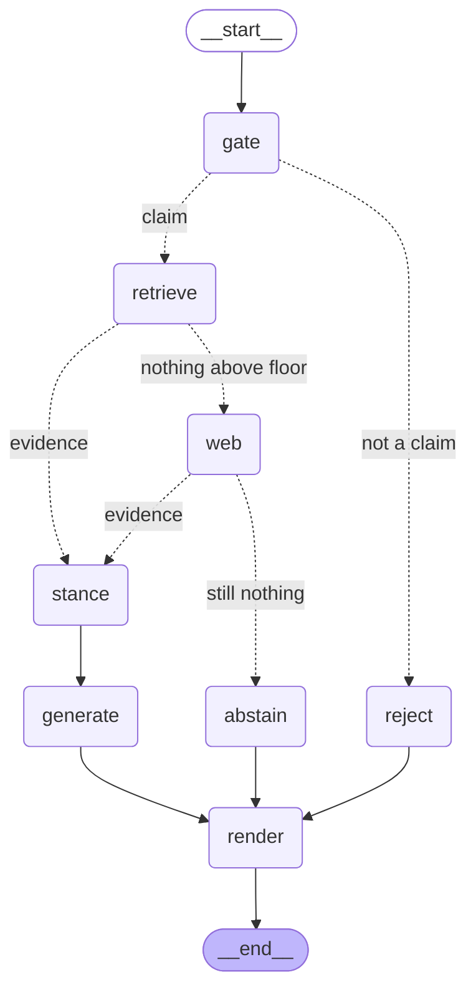

# VerifAI

A fact-verification RAG system that **knows when to say nothing**.

Give it a claim; it retrieves evidence from a curated news corpus, weighs each
source's credibility, and returns a cited verdict — or declines, when the
evidence isn't there.

```bash
python -m serve.cli "India's software exports reached 222 billion dollars in 2024-25"
#  → TRUE, 70% confidence, 3 sources cited

python -m serve.cli "the moon is square in shape"
#  → ABSTAINED. Zero LLM calls. Nothing cleared the relevance floor.
```

Claims arrive as **text, a voice note, a screenshot, or a document** — and the
report comes back in the language the claim was made in.

```bash
python -m serve.cli claim.mp3                    # Whisper → verify → spoken reply
python -m serve.cli screenshot.png               # OCR → is this even a claim? → verify
python -m serve.cli --document report.docx "…"   # check a claim against a file
uvicorn serve.api:app                            # web UI, paste screenshots with Ctrl+V
```

> **Demo recording goes here.** Record with `python -m demo.run_demo` (~80s) and
> embed the GIF at `demo/screenshots/demo.gif`.

---

## What makes it different

Most RAG systems cannot say "I don't know", because retrieval always returns
*something*. Cosine similarity has no concept of *nothing here matches* — ask
for the top 5 documents and you get 5 documents, however irrelevant.

Feed a naive pipeline **"the moon is square in shape"** and it will dutifully
retrieve the five least-irrelevant articles it owns and write a confident
analysis. The previous version of this system answered that exact claim with a
700-word report about a celebrity's bridal henna and a foldable phone review.

VerifAI has three exits, and two of them cost nothing:

| Exit | When | Cost |
|---|---|---|
| **Verified** | evidence cleared the relevance floor | 1 LLM call |
| **Abstained** | nothing relevant was found | **0 LLM calls** |
| **Rejected** | the input was not a checkable claim | **0 LLM calls** |

On 20 hand-written claims the corpus provably cannot answer, it abstained on
**20/20**. Across 200 FEVER claims it issued **zero** confidently-wrong verdicts.

---

## Results

Full numbers and methodology: [`eval_harness/results/RESULTS.md`](eval_harness/results/RESULTS.md).
Reproduce with `python -m eval_harness.run_eval --all`.

### Retrieval: before and after the chunking fix

`all-MiniLM-L6-v2` truncates at 256 tokens (~1,000 characters). The original
index embedded whole articles — median length 2,996 characters — so roughly two
thirds of the median document was never in a vector, and **nothing raised an
error**.

Measured over 200 known-item queries drawn from 100 corpus articles. Each
article contributes a query from its **head** (inside the embedder's window)
and one from its **tail** (beyond it). The head slice is the control.

| Tail queries — the truncated region | recall@1 | recall@5 | MRR |
|---|---:|---:|---:|
| Old index (whole articles embedded) | 0.47 | 0.76 | 0.598 |
| New index (chunked 700/100) — *only chunking changed* | **0.88** | **0.95** | 0.904 |
| New index + BM25 fusion + cross-encoder | **0.98** | **0.99** | 0.982 |

| Head queries — control | recall@1 | recall@5 | MRR |
|---|---:|---:|---:|
| Old index | 0.95 | 0.98 | 0.965 |
| New index | 1.00 | 1.00 | 1.000 |

The two indexes are statistically tied on the head slice and 41 points apart on
recall@1 for the tail. That gap is the truncation bug, isolated — same corpus,
same embedding model, same queries.

**Truncation did not make tail content unfindable.** News articles are
topically coherent, so the head vector still retrieves the article by subject.
What it destroyed was *ranking precision*: the correct article was ranked first
only 47% of the time.

> Two decimal places are meaningful; the third is not. Chroma's HNSW is an
> approximate index and the eval moved ±0.01 between runs.

### End-to-end behaviour

| | |
|---|---:|
| Abstention on 20 unanswerable claims | **20 / 20** |
| — caught by the relevance floor (no LLM call) | 16 |
| — caught by the LLM after reading evidence | 4 |
| FEVER: claims seen | 200 |
| FEVER: abstention rate | 0.975 |
| **FEVER: confidently-wrong verdicts (≥70%)** | **0** |

FEVER's gold evidence is Wikipedia, which this corpus does not contain, so a
high abstention rate there is *correct behaviour*, not a failure. Of the 5
claims it did commit to, all 5 were right — but n=5 carries no statistical
weight and shouldn't be read as an accuracy figure. The meaningful numbers on
that set are the abstention rate and the zero false-confidence count, both
computed over all 200.

### Why two mechanisms, not one threshold

The relevance floor was calibrated by sweeping 13 values, not guessed. It
separates *absent from the corpus* from *present in the corpus* cleanly —
every absurd or out-of-corpus claim scored **≤ 0.006**. But it cannot separate
*supports this claim* from *is merely about the same subject*: every claim that
survived every floor was one asserting a false fact about a subject the corpus
covers well ("OpenAI was founded in 2010", scoring 0.86).

Raising the floor from 0.02 to 0.60 improves adversarial abstention only
0.70 → 0.85 while costing real recall. So the floor handles the cheap cases and
the LLM's `directly_relevant` judgement handles the rest. That is why the output
schema has that field.

---

## Multimodal input

| Input | How | Comes back as |
|---|---|---|
| Text | — | report in the detected language |
| Voice | Groq `whisper-large-v3` | report **+ spoken mp3** in that language |
| Image | Tesseract OCR | extracted sentence, then a verdict |
| PDF / DOCX | PyPDF2 / python-docx | verdict, or a claim extracted from the file |

The **image** case is the one worth explaining. The workflow it serves: you see
a claim in an Instagram or WhatsApp post, screenshot it, paste it in with
`Ctrl+V`. OCR lifts the sentence out, and the claim gate then answers the
question you actually have — *is this even a checkable factual claim, or is it
opinion, a joke, or engagement bait?* Only then does verification run.

**A Hindi claim is not translated back.** It is translated *into* English to
search an English index, and the report is then **generated in Hindi** by the
model. One generation, one verdict — a back-translated report drifts from the
one the API returned, and verdict labels can shift in the round trip.

### Attaching a document cannot make its claim true

Upload a file asserting something and ask whether that thing is true, and a
naive system confirms it using your own attachment as evidence. That is the most
obvious way to fool a fact-checker, so an upload:

- is capped at **0.6 credibility**, applied *after* normal weighting so it is a
  ceiling rather than an input — an upload can't inherit authority from a
  high-scoring domain,
- is labelled `⚠ UNVERIFIED USER SUBMISSION` in the evidence block the model
  sees, with an instruction to treat it as the claim restated rather than
  evidence for it,
- still goes through the same relevance floor, so an irrelevant upload is
  dropped rather than padding the evidence list.

---

## Architecture

Two tiers that share **files, not imports**.

```
TIER 1 · ingest/                    TIER 2 · serve/
run on demand, offline              runs while you demo
write-only                          read-only

clean → chunk → embed → index       gate → retrieve → stance → generate
            │                                    ↑
            ▼                                    │
    ┌───────────────────────┐   reads            │
    │  index/v1/            │────────────────────┘
    │    chroma/            │
    │    parents/           │   THE CONTRACT
    │    bm25.pkl           │
    │    manifest.json      │
    └───────────────────────┘
```

The index is a **versioned artifact**. Tier 1 builds into `index/v{n}/`,
validates it, and only then points `index/CURRENT` at it. The corpus can be
rebuilt or the embedding model swapped without touching serving code, and the
API restarts without re-crawling anything. Rolling back is a one-line file write.

`manifest.json` is a safety interlock: it records the embedding model and
dimension, and **Tier 2 refuses to boot on a mismatch**. Indexing with one model
and querying with another produces plausible garbage and raises nothing — this
is fifteen lines that catch the single most common silent RAG failure.

### The serving graph

Generated from the running code with `python -m serve.cli --graph`, so it cannot
drift from what the system does.



Retrieval runs at **chunk level** — dense (Chroma) and sparse (BM25) fused by
reciprocal rank, then reranked by a cross-encoder — and expands to **whole
articles** only after compression. Chunks are what embed well; articles are what
the LLM reasons well over. Reranking before expansion matters: the cross-encoder
also truncates at 512 tokens, so reranking full articles would reintroduce the
exact bug the chunking fixed.

---

## Quickstart

**Prerequisites:** Python 3.11+, ~2 GB disk, no GPU.

```bash
git clone <this-repo> && cd fact-verification-system2

python -m venv venv
venv\Scripts\activate            # Windows
# source venv/bin/activate       # macOS / Linux

pip install -e .

cp .env.example .env             # then paste a Groq key (free)
```

Get a free Groq key at [console.groq.com/keys](https://console.groq.com/keys).

**Obtain the trained models** — two fine-tuned BERTs, ~870 MB, too large for
git. See [Models](#models) below.

```bash
python -m ingest.run --from-csv   # build the index (~13 min first run, then 1s)
python -m serve.cli "India's software exports reached 222 billion dollars in 2024-25"
python -m demo.run_demo           # the full demo, ~80 seconds
```

### Commands

| | |
|---|---|
| `python -m ingest.run --from-csv` | build and publish an index |
| `python -m ingest.run --status` | what's currently published |
| `python -m serve.cli "claim"` | verify a claim |
| `python -m serve.cli --trace "claim"` | with per-node progress |
| `python -m serve.cli --json "claim"` | structured output |
| `python -m serve.cli --no-web "claim"` | index only, no web fallback |
| `python -m serve.cli clip.mp3` | verify a voice note |
| `python -m serve.cli shot.png` | verify a screenshot (needs Tesseract) |
| `python -m serve.cli --document f.pdf "claim"` | check a claim against a file |
| `python -m serve.cli --export html,docx "claim"` | also write those formats |
| `uvicorn serve.api:app` | web UI at `127.0.0.1:8000` |
| `cd frontend && npm run dev` | React dev server with hot reload |
| `python -m demo.run_demo` | the demo |
| `python -m eval_harness.run_eval --all` | the full evaluation |
| `pytest` | 36 tests, ~7s, no API calls |

Exit codes: `0` verified · `2` abstained · `3` rejected · `4` index problem ·
`5` API quota.

---

## Models

Four models run locally on CPU (~1 GB, ~10s cold start). Two are fine-tuned and
ship separately because of their size:

| Model | Purpose | Source |
|---|---|---|
| `all-MiniLM-L6-v2` | embeddings | HuggingFace, downloaded automatically |
| `ms-marco-MiniLM-L-6-v2` | cross-encoder reranker | HuggingFace, automatic |
| **claim detector** | BERT, fine-tuned on 280k FEVER examples | see below |
| **stance detector** | BERT, fine-tuned on 208k FEVER-NLI pairs | see below |

<!-- TODO: publish the two fine-tuned models and replace this block with the
     download command. HuggingFace Hub is free and the models become a portfolio
     artifact in their own right. -->

Place them at `models/claim_detector/final/` and `models/stance_detector/final/`.
Training notebooks are in [`notebooks/`](notebooks/) if you'd rather retrain.

Set `HF_OFFLINE=false` for the first run so the two automatic models can
download, then leave it `true`.

**Image input additionally needs Tesseract**, which is a system binary rather
than a pip package:

| | |
|---|---|
| Windows | [UB Mannheim installer](https://github.com/UB-Mannheim/tesseract/wiki) |
| macOS | `brew install tesseract` |
| Linux | `apt install tesseract-ocr` |

Then add it to `PATH`, or set `TESSERACT_CMD` in `.env`. **Every other input
type works without it** — image upload reports that OCR is unavailable and
nothing else is affected.

---

## The web interface

A small React app (JavaScript, no TypeScript) in [`frontend/`](frontend/). No
accounts, no auth — it is a single-user local tool.

```bash
uvicorn serve.api:app                 # backend on :8000, serves the built UI
cd frontend && npm install && npm run dev   # optional: hot reload on :5173
```

**How it connects to FastAPI.** In development the Vite dev server proxies
`/verify`, `/health` and `/download` to `127.0.0.1:8000`, so the browser sees a
single origin and there is no CORS preflight to fight with on a multipart
upload. `npm run build` writes to `ui/dist/`, which FastAPI then serves itself —
same relative URLs, one process, no proxy. **If you never install Node**, the
API falls back to a self-contained `ui/index.html`, so the app still works.

Progress is streamed over server-sent events: the backend emits one event per
completed graph node, so the interface shows `read input → language → claim
check → search index → verdict` as it happens rather than spinning until the
end. Adding a node to the pipeline adds a step to the UI with no other change.

**History** is kept in `localStorage` — every verification you run, with its
verdict, re-openable later. Nothing is sent anywhere or stored server-side;
there are no accounts to scope a server-side history to, and it survives the
backend restarting when you rebuild the corpus.

---

## How it works

**Tier 1** cleans the corpus, splits it at 700 characters with 100 overlap,
embeds each chunk, and writes four artifacts. Chunk IDs are content hashes, so
re-running upserts identical rows and a corpus fingerprint makes an unchanged
re-run a **1-second no-op**. Identical text collapsing to one row is deliberate:
syndicated wire copy on three sites must not look like three independent sources
corroborating a claim.

**Tier 2** loads those artifacts once at startup. A claim passes a fine-tuned
BERT gate, then hybrid retrieval, then a compressor pipeline — cross-encoder
rerank → relevance floor → credibility scoring — assembled as a single LangChain
`DocumentCompressorPipeline`. Surviving chunks expand to their parent articles,
a second fine-tuned BERT labels each one's stance, and Groq produces a verdict
constrained to a Pydantic schema.

Every `evidence_index` the model emits is **checked in code** against the
documents actually retrieved. A citation to `[9]` in a 7-item context is a valid
object but a fabricated citation, so it triggers one retry with the specific
failure quoted back, then removal with the removal disclosed in the report.

**Stance labels are hints, not verdicts.** The stance model is 73.6% accurate
and weakest on REFUTES — probed by hand it called a direct contradiction
SUPPORTS at 0.52 confidence. So its confidence travels with each label and the
prompt instructs the model to follow the evidence text wherever the two
disagree. In the demo run it overrides the stance model on roughly a third of
items.

---

## Tech stack

**LangChain 0.3** — `EnsembleRetriever`, `ContextualCompressionRetriever`,
`DocumentCompressorPipeline`, `CacheBackedEmbeddings`, `LocalFileStore` +
`create_kv_docstore`, `with_structured_output`
· **LangGraph 1.0** — the branching graph and streaming
· **Chroma** — vector store · **rank-bm25** — sparse retrieval
· **sentence-transformers** — embeddings + reranker
· **transformers** — the two fine-tuned BERTs
· **Groq** — `llama-3.3-70b-versatile`
· **Tavily** — web fallback · **pydantic-settings** — config

Chosen for retriever composition and structured output specifically:
`DocumentCompressorPipeline` chains reranking, the relevance floor and
credibility scoring into one object the retriever calls, and
`with_structured_output` makes the verdict a validated model rather than
something regexed out of prose — which was a real bug in the first version,
where the exported report could contradict the API response. Crawling and file
rendering are plain Python; not everything needs a framework.

---

## Limitations

Stated plainly, because they affect how the numbers should be read.

**Publish dates are fabricated.** 1,622 of 1,687 articles (96%) carry
placeholder January-1 dates, introduced at scrape time by a URL-parsing
heuristic. They are not recoverable. Every chunk carries `date_reliable: false`,
the manifest records it, and credibility scoring drops the recency term and
reweights to domain 0.7 / type 0.3 rather than letting a fabricated date drive
30% of a score.

**The corpus is the wrong shape for general fact-checking.** 1,687 RSS articles,
heavily tech and entertainment. It cannot answer questions about history,
science, or anything outside its window — which is why 97.5% of FEVER claims
abstain. Web search fallback covers more than it should have to. A Wikipedia
tier would fix it.

**`verdict_accuracy` is measured on a small sample.** Only 5 of 200 FEVER claims
were answerable from this corpus. Read the abstention and false-confidence
numbers instead; those are over the full 200.

**The claim detector is narrower than its name.** It reports 1.00 test accuracy,
which is a warning sign rather than a triumph: probed by hand it separates
declarative sentences from questions and opinions, and rates gibberish as a
claim at 0.997. It is a cheap filter that keeps questions out of the retrieval
path, and it is used for nothing else.

**Known-item recall is an upper bound.** The eval's queries are verbatim
passages from the corpus, so gold documents score near 1.0. Real paraphrased
claims score lower. The *delta* between the two indexes is valid — both faced
identical queries — but the absolute numbers are optimistic.

**Not production software.** Single-user, no auth, no rate limiting, no
deployment. It is a portfolio project and the scope was chosen deliberately.

---

## Repository layout

```
ingest/         Tier 1 — clean, chunk, embed, index, publish
serve/          Tier 2 — LangGraph app + FastAPI
  nodes/        adapt · language · gate · retrieve · websearch · stance ·
                generate · terminal · render · export
core/           the only shared surface — config, models, credibility,
                compressors, prompts
frontend/       React app (Vite, JavaScript) — builds into ui/dist/
ui/             index.html, the no-build fallback interface
eval_harness/   datasets, metrics, runners, committed results
demo/           run_demo.py
tests/          36 tests on the failures that produce no error
index/          the contract — CURRENT → v1/  (gitignored)
```

`serve/` imports nothing from `ingest/`. There's a test that enforces it.
